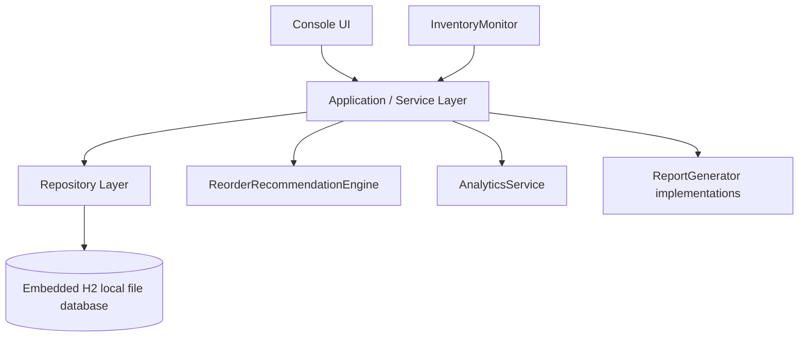

# Smart Warehouse Stock Optimization System

## Overview

This Java 25 console application manages products, suppliers, stock operations, reorder recommendations, analytics, and reports. It uses Maven, JDBC, and embedded H2; it has no GUI, web API, or external database server.

## Problem statement and objectives

Manual stock records make it hard to prevent invalid dispatches, retain movement history, and identify replenishment needs. The project persists inventory locally, validates catalog and stock operations, prevents negative stock during concurrent work, produces explainable reorder recommendations, and generates operational reports.

## Major features and functional modules

| Module | Responsibility |
|---|---|
| Product and supplier services | CRUD, validation, search, SKU uniqueness, and supplier checks |
| Inventory service | Atomic stock-in, stock-out, return, and adjustment operations |
| Transaction service | Retrieves and polymorphically formats transaction subclasses |
| Reorder engine | Creates deterministic, explainable replenishment recommendations |
| Analytics service | Inventory, category, supplier, and transaction statistics |
| Reporting | Writes CSV and text reports |
| Inventory monitor | Optional daemon thread that prints stock alerts |

## Technologies

- Java **25** JDK
- Maven and the included script-only Maven Wrapper (`mvnw`, `mvnw.cmd`)
- H2 2.3.232 embedded database
- JDBC and JUnit 5

## Architecture



`ConsoleApplication` calls the product, supplier, inventory, transaction, analytics, and reorder services. Services use JDBC repositories; the monitor is toggled by the console and reports use the `ReportGenerator` interface.

## Project structure

```text
src/main/java/com/warehouse/
  database/ repository/ model/ service/ ui/ io/ thread/
src/test/java/com/warehouse/  JUnit tests and isolated test database helper
docs/                         design and submission documentation
```

## Installation and commands

Install a Java 25 JDK. No database server setup is required. The wrapper is script-only: this repository does **not** contain `maven-wrapper.jar`.

```bash
# Windows: tests, then application
mvnw.cmd clean test
mvnw.cmd exec:java

# Linux/macOS: tests, then application
./mvnw clean test
./mvnw exec:java
```
We can run the project by running the Main.java file
## Database behavior

The application uses the persistent H2 local-file URL `jdbc:h2:file:./data/warehouse;DB_CLOSE_DELAY=-1`. Startup creates `./data`, creates the schema, and seeds sample data only if the product table is empty. Later application runs reuse `data/warehouse.mv.db`. Tests use unique in-memory H2 databases only for isolation.

## Reporting

The report option creates `inventory_report.csv`, `low_stock_report.csv`, `transaction_report.txt`, and `warehouse_summary.txt` under `./reports/`. CSV has headers, quotes text values, and escapes embedded double quotes. Empty datasets still produce headers; an empty text transaction report says that no transactions were recorded.

## Smart reorder algorithm

The rule-based engine uses current stock, `minimumStockLevel` as safety stock, supplier lead time, and actual `STOCK_OUT` history. Observed daily demand is total stock-out quantity divided by the inclusive calendar-day range of those transactions, rounded up. With no stock-out history it is zero. The reorder point is `(observed daily demand × lead time) + safety stock`; an unassigned supplier uses the documented seven-day fallback. A recommendation at or below that point replenishes to `reorder point + safety stock`. See [algorithm details](docs/reorder-algorithm.md).

## Multithreading and synchronization

`InventoryMonitor` implements `Runnable` and runs as a daemon when enabled. `InventoryService` uses a per-product Java lock and H2 `SELECT ... FOR UPDATE` inside one JDBC transaction, so the stock update and transaction insert commit or roll back together.

## CSE2006 concept mapping

| Concept | Actual class/file | Use |
|---|---|---|
| Fundamentals | `ui/InputValidator`, `ui/ConsoleApplication` | loops, conditions, methods, and menu switch expressions |
| OOP, encapsulation, constructors | `model/Product`, `model/Supplier` | private fields, constructors, accessors, domain methods |
| Inheritance and abstract classes | `model/StockTransaction` | base type for four transaction types |
| Overriding and polymorphism | transaction subclasses; `TransactionService` | overridden `getTransactionDetails()` through `StockTransaction` references |
| Interface and enums | `ReportGenerator`; `TransactionType`, `ReorderPriority` | report implementations and classifications |
| Exceptions | `exception/WarehouseException` subclasses | validation, business, and database errors |
| Multithreading and synchronization | `InventoryMonitor`, `InventoryService` | daemon monitoring, locks, and row-level JDBC coordination |
| Collections and streams | `AnalyticsService`, `ReorderRecommendationEngine` | lists, maps, grouping, filtering, sorting, reduction |
| I/O | CSV/text generators | `Path`, `Files`, `BufferedWriter` |
| JDBC | `database/`, `repository/` | H2 schema, prepared statements, result mapping, transactions |

JPA is **not implemented**; persistence is JDBC only.

## Testing

JUnit tests cover CRUD, validation, stock boundaries, rollback, concurrent stock-outs, reorder boundaries, analytics, and report generation. Each setup receives a unique in-memory H2 URL, so test results do not depend on `warehouse.mv.db` or order. The last verified run executed **23 tests**, with **0 failures** and **0 errors**.

## Limitations and future enhancements

The CLI has no authentication, roles, GUI, external integration, configurable demand window, or schema migration mechanism. Future work could add configurable reorder policies, warehouse locations/transfers, validated imports, and expanded audit metadata.
