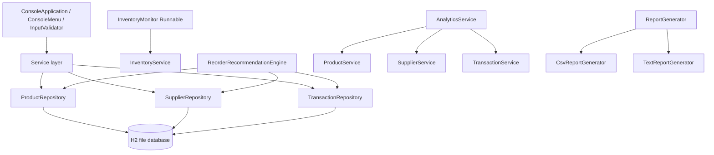
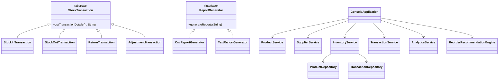

# Architecture

The application is a layered CLI. `Main` initializes the H2 schema, builds repositories and services, then starts `ConsoleApplication`.

`InventoryService` owns stock mutation rules. `AnalyticsService`, `ReorderRecommendationEngine`, and report generators read through the service/repository components shown above. `InventoryMonitor` is a daemon thread started and stopped by the console.

