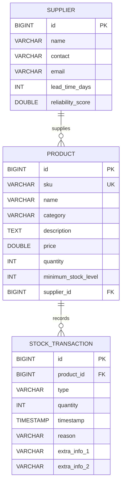

# Database design

The application database is H2 at `./data/warehouse`. `DatabaseInitializer` uses `CREATE TABLE IF NOT EXISTS` and seeds data only when no products exist.

`PRODUCT.supplier_id` is nullable and becomes null when its supplier is deleted. Deleting a product cascades to its stock transactions. The `type` column stores the name of `TransactionType`; `extra_info_1` and `extra_info_2` hold subtype-specific details such as purchase order, sales order/destination, return details, or adjustment details.

Fresh schemas constrain non-negative product price, quantity, and minimum stock level; positive supplier lead time; reliability from 0 to 5; and non-zero transaction quantity.
