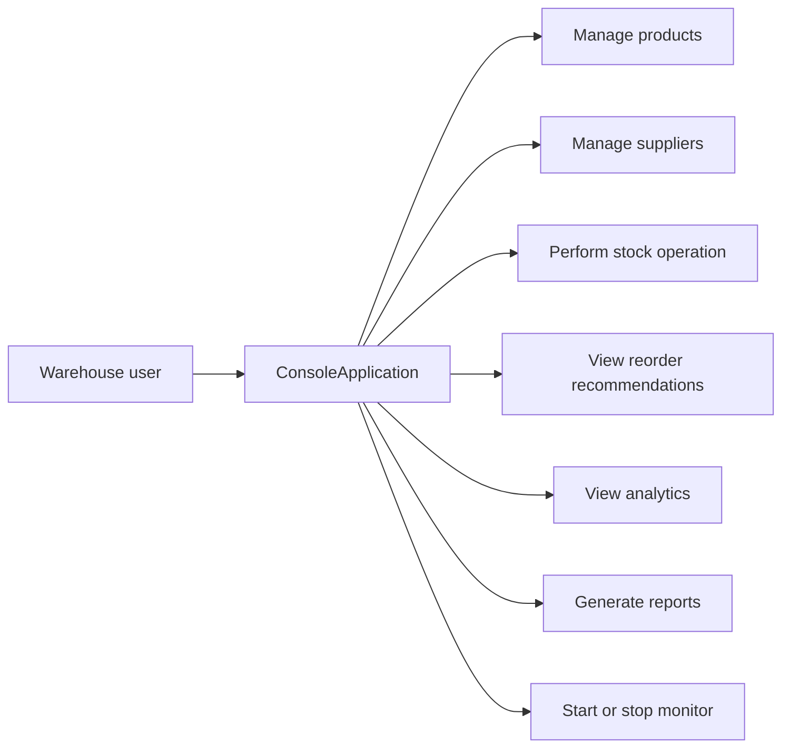
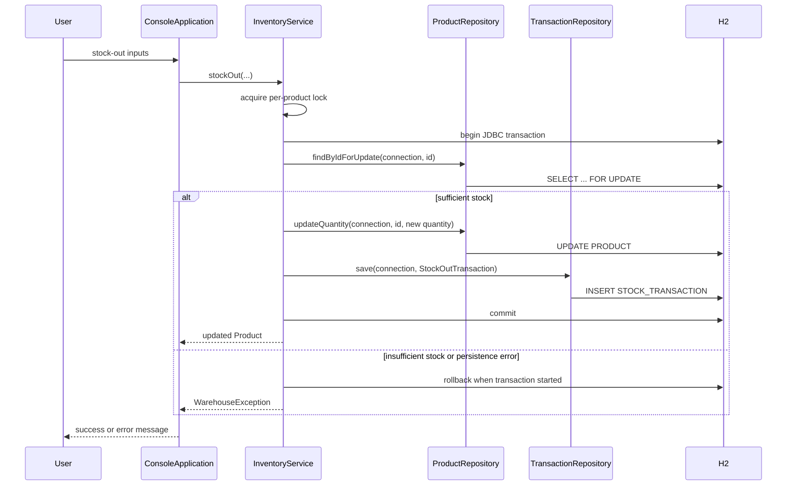

# Workflow and use cases

The console collects validated input. Service methods either return a result or throw a `WarehouseException`, which the console displays as an understandable error.

## Stock-out sequence

## Reorder workflow

The engine reads products, suppliers, and `STOCK_OUT` history; calculates observed daily demand and reorder point; retains products at or below the point; explains and prioritizes each recommendation; then orders output from critical to low priority.
